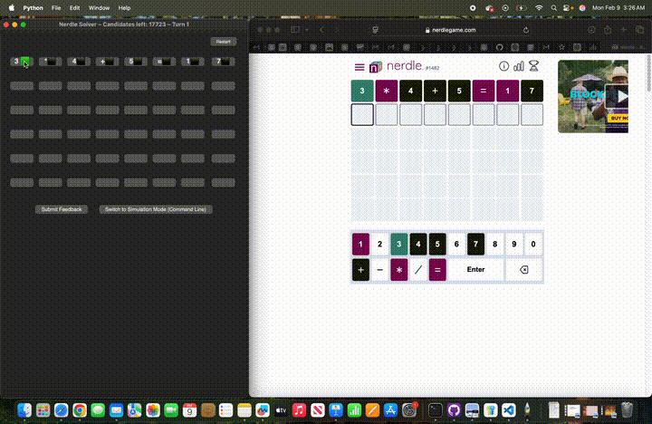

# Nerdle Solver — Heuristic + Feedback Simulation

A heuristic-driven solver for **Nerdle-style equation puzzles** built around Wordle-style feedback simulation.
The solver maintains a candidate set of valid equations and iteratively narrows it by matching the exact feedback pattern (G/P/B) produced by each guess.

---

## Overview

Given a list of valid Nerdle equations (loaded from a text file), the solver supports:

- **Interactive solve mode**: you enter the feedback from the official game after each guess.
- **Simulation mode**: the solver computes feedback internally and measures average performance across random samples or the full answer set.

---

## Demo

▶️ **Full demo (1 minute):** 

---

## How It Works

### 1) Wordle/Nerdle-accurate feedback (G / P / B)
The core of the solver is an exact feedback function:

- **G (Green):** correct character in the correct position  
- **P (Purple):** character exists in the secret but in a different position  
- **B (Black):** character does not appear enough times to be matched (includes overused duplicates)

Feedback is computed in two passes:
1. Mark all greens.
2. Mark purples only if an unmatched copy of that symbol remains.

---

### 2) Candidate filtering via feedback simulation
After each guess, the solver filters the candidate list to only equations that would produce **the same feedback pattern** if they were the secret.

This is the main “constraint propagation” mechanism: each new feedback string sharply reduces the remaining space.

---

### 3) Heuristic guess selection
For most of the solve, the solver chooses a guess **from within the remaining candidate set** using a scoring heuristic based on:

- **Equation “form” frequency**  
  A `form_key` abstraction (digits → `D`) captures the structural shape of an equation (e.g., `DD+D=DD`).
  The solver favors candidates whose form is common among remaining candidates.

- **Unseen symbol coverage**  
  The solver tracks which symbols have appeared in previous guesses and rewards guesses that introduce new symbols.

- **Overall symbol variety**  
  Candidates with more distinct characters are favored to extract more information per guess.

When the candidate set becomes small (≤ 10), the solver stops optimizing and guesses randomly among remaining candidates.

---

## Starting Guess

The solver uses a hard-coded first guess:

- `3*4+5=17`

The intent is to maximize early information by avoiding repeated symbols.

---

## Simulation & Evaluation

The code includes:
- **Random sampling simulation** (`simulate_many_games`) for quick performance checks
- **Full population simulation** (`simulate_all_answers`) to compute exact statistics and a guess-count distribution across all valid answers in the provided dataset

---

## Notes

- The solver’s correctness depends on the provided equation list file (e.g. `NerdleClassicRestricted.txt`).
- The project is primarily about **algorithmic logic and heuristics** (feedback simulation + candidate filtering + scoring), not heavy dependencies.

